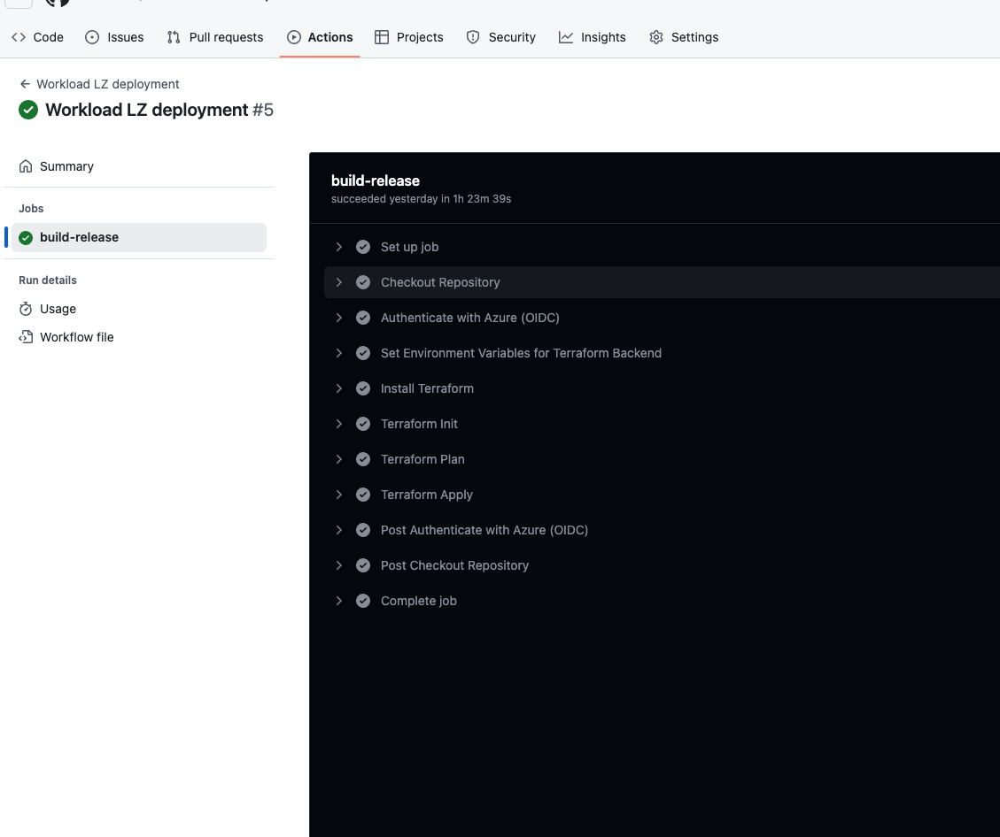

Azure APIM and App Service Environment v3 Landing Zone Accelerator (ALZ)
=======================================================================

APIs are at the core of how modern organisations deliver and consume digital services—internally across business units, and externally to partners, customers, and developers. Internally, APIs enable secure access to line-of-business systems, custom-built solutions, and third-party services, often built using Azure PaaS offerings like Azure Functions, Logic Apps, and Azure App Services.

For organisations with stringent compliance, network isolation, and high-scale hosting requirements, APIs are frequently deployed into an Azure App Service Environment v3 (ASEv3). ASEv3 is a fully isolated, highly scalable, single-tenant App Service offering that runs within a customer’s Azure Virtual Network. It supports internal load balancing, private IP addresses, custom domain names, and fine-grained network security, making it ideal for hosting mission-critical APIs and applications that must not be exposed to the public internet.

As the use of APIs continues to grow, so does the need for centralized governance, security, and lifecycle management. This is where Azure API Management (APIM) becomes essential. It acts as a unified gateway to manage, secure, and publish APIs—regardless of whether they are hosted in Azure App Services, ASEv3, Functions, or Logic Apps. With APIM, developers and administrators can apply consistent policies, rate limits, and authentication mechanisms across all APIs.

To enhance global performance, availability, and security, Azure Front Door can be placed in front of API Management. Azure Front Door offers a globally distributed, highly available edge platform that provides features such as anycast routing, SSL termination, Web Application Firewall (WAF), URL-based routing, and caching. This combination ensures that both internal and external APIs are delivered reliably and securely—regardless of where the backend is hosted.

When integrated together:

  - APIs hosted in ASEv3 can remain private, accessed only through APIM and Front Door.

  - Azure API Management acts as the control plane, enforcing policies and enabling visibility.

  - Azure Front Door serves as the global entry point, enforcing edge security and optimising traffic.


Architecture
-------------

This architecture empowers organisations to deliver secure, scalable, and compliant APIs to both internal and external consumers, while maintaining centralised governance and enterprise-grade security. It is designed to be deployed using Infrastructure as Code (IaC) and DevOps practices, enabling rapid and consistent deployment across multiple environments.

<div align="center">
  
</div>


---

## Terraform Deployment Overview

The Terraform code in this project deploys the following resources and configurations:

---

#### Virtual Network with 6 subnets:

- ***App Service Environment*** — used to deploy the ASEv3.
- ***API Management*** — used to deploy the APIM instance.
- ***Azure Bastion*** — used to deploy the Azure Bastion Host.
- ***Virtual Jumpbox*** — used to deploy the Azure VM for administrative purposes.
- ***Private Endpoints*** — used to deploy Azure Private Endpoints.
- ***GitHub Runners*** — used to deploy self-hosted GitHub Runners on Azure Container Apps for CI/CD pipelines.

---

#### Network Security Group (NSG) rules for the API Management Subnet

- `Allow-Client-Communication` — Inbound from the internet on ports **80** and **443**.
- `Allow-Management-Endpoint-Portal-PPS` — Inbound from APIM subnet on port **3443**.
- `Allow-Infra-LB` — Inbound from Azure Load Balancer on port **6390**.
- `Allow-TrafficManager-Routing` — Inbound from Azure Traffic Manager on port **443**.
- `Allow-AzureStorage-Access` — Outbound to Azure Storage on port **443**.
- `Allow-SQL-Core` — Outbound to Azure SQL on port **1433**.
- `Allow-KeyVault-Core` — Outbound to Azure Key Vault on port **443**.
- `Allow-Monitor-Core` — Outbound to Azure Monitor on ports **1886** and **443**.

---

#### Azure App Service Environment v3 (ASEv3)

- ***ASEv3*** — The App Service Environment instance.
- ***App Service Plan*** — The plan used to host APIs in ASEv3.
- ***Web Apps*** — APIs hosted in the ASEv3.
- ***Function Apps*** — Azure Functions hosted in the ASEv3.

---

#### Azure API Management

- ***API Management*** — The API Management instance for central API governance.

---

#### Azure Front Door

- ***Front Door*** — The global entry point and load balancer.

---

#### Azure Bastion Host

- ***Bastion Host*** — Provides secure RDP/SSH access to VMs without public IPs.

---

#### Azure Virtual Machine (JumpBox)

- ***Virtual Machine*** — Windows VM used for administrative/jumpbox purposes.

---

#### Azure Private Endpoints

- ***Private Endpoints*** — Private access to PaaS services.

---

#### Azure Container Apps

- ***Container Apps*** — Hosts self-hosted GitHub Runners.

---

#### Azure Service Bus

- ***Service Bus Namespace***
- ***Service Bus Queues***
- ***Service Bus Topics***

---

#### Azure SQL Database

- ***SQL Server***
- ***SQL Database***

---

#### Azure Key Vault

- ***Key Vault*** — For secrets, certificates, and keys.

---

#### User Assigned Managed Identity

- ***Managed Identity*** — For secure resource access with RBAC.

---

#### GitHub Actions

- ***GitHub Actions*** — The automation workflow logic.

---

#### GitHub Runners

- ***GitHub Runners*** — Self-hosted runners deployed to Azure.

---

#### Azure Log Analytics

- ***Log Analytics*** — Central logging and telemetry workspace.

---

#### Azure Application Insights

- ***Application Insights*** — For API and app observability.

---

## Optional: Azure Web Application Firewall (WAF)

You can optionally deploy a **Web Application Firewall (WAF)** policy and associate it with the frontend of **Azure Front Door** to protect **API Management** from malicious attacks.

The WAF policy uses the **OWASP default rule set** for protection.

### 📚 References

- 📘 [Tutorial: Azure Web Application Firewall on Azure Front Door](https://learn.microsoft.com/en-us/azure/web-application-firewall/afds/afds-overview)  
- 📘 [Tutorial: Create a Web Application Firewall policy on Azure Front Door using the Azure portal](https://learn.microsoft.com/azure/web-application-firewall/afds/waf-front-door-create-portal)  
- 📘 [Open Web Application Security Project (OWASP)](https://owasp.org/)


Securing API Management with Azure Front Door and NSG Rules
---
When API Management is deployed in a virtual network and configured to use the external access type, the API Gateway and Developer Portal remain accessible from the public internet via an external load balancer, while still allowing the API Gateway to access resources within the VNet.
To force client applications to invoke the API Gateway exclusively through Azure Front Door, follow these steps:

<u>Restrict API Management access to Azure Front Door:</u>


  - Configure an inbound rule in the Network Security Group (NSG) associated with the subnet hosting API Management.

  - Allow inbound traffic on ports 80 and 443 (HTTP/HTTPS) only from the AzureFrontDoor.Backend service tag.

  - This configuration ensures that:

    1.  The public endpoints of API Management (including the Gateway and Developer Portal) only accept traffic routed through Azure Front Door.

    2. Direct internet access to APIM endpoints is effectively blocked.

 
📘 [Tutorial: How do I lock down the access to my backend to only Azure Front Door](https://learn.microsoft.com/en-us/azure/frontdoor/front-door-faq)

<u>Accessing the API Management Developer Portal</u>
- If users need access to the API Management Developer Portal, you have two options:
1. Allow IP Ranges:
    - Create an additional NSG rule to allow traffic on ports 80/443 from a specific range of trusted public IP addresses (e.g., corporate networks).
2. Use the Self-Hosted Developer Portal:
    - Deploy the self-hosted developer portal either on-premises or in the cloud (e.g., on an Azure VM).
    - Then, configure an NSG rule on the API Management subnet to allow HTTP/HTTPS traffic only from the IP address of the server/VM hosting the portal.


## Deployment prerequisites
-------------
- Azure subscription (if you don't have an Azure subscription, create one before you begin). 
- Azure storage account  (if you don't have an Azure Storage Account, create it before you begin).
- User assigned managed identity (if you don't have a user assigned managed identity, create it before you begin).
- Contributor and User access administrator role assigned to the user assigned managed identity for the Azure subscription.
- GitHub organization (if you don't have a GitHub organization, create it before you begin).
- GitHub repository (if you don't have a GitHub repository, create it before you begin).
- GitHub personal access token (if you don't have a GitHub personal access token, create it before you begin).
- Github secrets (if you don't have a GitHub secrets, create it before you begin).

<div align="left">
  
</div>

## Step 1: Clone the Repository

Open your terminal and run the following command to clone the repository:

```bash
git clone https://github.com/your-username/alz-workload-projectX.git


cd alz-workload-projectX
``` 
## Step 2: Modify the terraform.tfvars file

Open the terraform.tfvars file and modify the following variables:

```bash
location = "northeurope"
tags = {
  environment = "dev"
  owner = "project-team"
}
subscription_id = "dd3318727-2ac4-4db5-8a63-f05891e25212f"
github_personal_access_token = "ghp_nqvICehNOJ6635sgsgJ4mRM4TKjym"
github_organization_name = "wots-mi"
version_control_system_type = "github"
version_control_system_repository = "alz-workload-projectX"

# Variables for Azure Virtual Network
resource_group_network = "rg-developer-vnet"
resource_group_workload = "rg-developer-workload"
resource_group_github_runners = "rg-github-runners"
resource_group_management = "rg-developer-management"
vnet_name = "vnet-dev-northeurope-001"
vnet_address_space = ["11.0.0.0/16"]
vnet_subnets = [
  {
    name           = "snet-dev-app_service_environment_v3-northeurope-001"
    address_prefixes = ["11.0.0.0/20"]
    delegation       = {
      name = "Microsoft.Web.hostingEnvironments"
      service_delegation = {
        name    = "Microsoft.Web/hostingEnvironments"
        actions = ["Microsoft.Network/virtualNetworks/subnets/action"]
      }
    }
  },
  {
    name           = "snet-dev-api_management-northeurope-001"
    address_prefixes = ["11.0.16.0/20"]
    service_endpoints = ["Microsoft.Storage", "Microsoft.KeyVault"]
  },
  {
    name           = "snet-dev-vmdesktop-northeurope-001"
    address_prefixes = ["11.0.33.0/24"]
  },
  {
    name          = "snet-dev-private_endpoints-northeurope-001"
    address_prefixes = ["11.0.34.0/24"]
  },
  {
    name = "snet-dev-container-apps-github-runners"
    address_prefixes = ["11.0.35.0/27"]
    delegation = {
      name = "Microsoft.App/environments"
      service_delegation = {
        name    = "Microsoft.App/environments"
        actions = ["Microsoft.Network/virtualNetworks/subnets/action"]
      }
    }
  },
  {
    name             = "AzureBastionSubnet"
    address_prefixes = ["11.0.36.0/24"]
  }
]

# Variables for Azure Network Security Groups
network_security_groups = [
  {
    network_security_group_name = "nsg-apim"
    subnet_id                  = "snet-dev-api_management-northeurope-001"
    security_rules = [
      {
        name                       = "Allow-Client-Communication"
        priority                   = 100
        direction                  = "Inbound"
        access                     = "Allow"
        protocol                   = "Tcp"
        source_port_range          = "*"
        destination_port_ranges     = ["80", "443"]
        source_address_prefix      = "Internet"
        destination_address_prefix = "VirtualNetwork"
      },
      {
        name                       = "Allow-Management-Endpoint-Portal-PPS"
        priority                   = 101
        direction                  = "Inbound"
        access                     = "Allow"
        protocol                   = "Tcp"
        source_port_range          = "*"
        destination_port_range     = "3443"
        source_address_prefix      = "ApiManagement"
        destination_address_prefix = "VirtualNetwork"
      },
      {
        name                       = "Allow-Infra-LB"
        priority                   = 102
        direction                  = "Inbound"
        access                     = "Allow"
        protocol                   = "Tcp"
        source_port_range          = "*"
        destination_port_range     = "6390"
        source_address_prefix      = "AzureLoadBalancer"
        destination_address_prefix = "VirtualNetwork"
      },
      {
        name                       = "Allow-TraficManager-Routing"
        priority                   = 103
        direction                  = "Inbound"
        access                     = "Allow"
        protocol                   = "Tcp"
        source_port_range          = "*"
        destination_port_range     = "443"
        source_address_prefix      = "AzureTrafficManager"
        destination_address_prefix = "VirtualNetwork"
      },
      {
        name                       = "Allow-AzureStorage-Access"
        priority                   = 104
        direction                  = "Outbound"
        access                     = "Allow"
        protocol                   = "Tcp"
        source_port_range          = "*"
        destination_port_range     = "443"
        source_address_prefix      = "VirtualNetwork"
        destination_address_prefix = "Storage"
      },
      {
        name                       = "Allow-SQL-Core"
        priority                   = 105
        direction                  = "Outbound"
        access                     = "Allow"
        protocol                   = "Tcp"
        source_port_range          = "*"
        destination_port_range     = "1433"
        source_address_prefix      = "VirtualNetwork"
        destination_address_prefix = "SQL"
      },
      {
        name                       = "Allow-KeyVault-Core"
        priority                   = 106
        direction                  = "Outbound"
        access                     = "Allow"
        protocol                   = "Tcp"
        source_port_range          = "*"
        destination_port_range     = "443"
        source_address_prefix      = "VirtualNetwork"
        destination_address_prefix = "AzureKeyVault"
      },
      {
        name                       = "Allow-Monitor-Core"
        priority                   = 107
        direction                  = "Outbound"
        access                     = "Allow"
        protocol                   = "Tcp"
        source_port_range          = "*"
        destination_port_ranges    = ["1886", "443"]
        source_address_prefix      = "VirtualNetwork"
        destination_address_prefix = "AzureMonitor"
      }
    ]
  }
]

# Variables for Azure App Service Environment
ase_name = "ase1984"
internal_load_balancing_mode = "Web, Publishing"

# Variables for Azure App Service Plans
app_service_plans = [
    {
        name                       = "sunrise"
        os_type                    = "Linux"
        sku_name                   = "I1v2"
        tags                       = {
            environment = "dev"
            program     = "oneFPS"
        }
    }
]

autoscale_settings = [
  {
    plan_name      = "sunrise"
    autoscale_name = "autoscale-plan-1"
    profiles = [
      {
        name = "default"
        capacity = {
          minimum = 1
          default = 2
          maximum = 3
        }
        rules = [
          {
            metric_name      = "CpuPercentage"
            operator         = "GreaterThan"
            threshold        = 75
            time_grain       = "PT1M"
            statistic        = "Average"
            time_window      = "PT5M"
            time_aggregation = "Average"
            direction        = "Increase"
            type             = "ChangeCount"
            value            = 1
            cooldown         = "PT1M"
          },
          {
            metric_name      = "CpuPercentage"
            operator         = "LessThan"
            threshold        = 20
            time_grain       = "PT1M"
            statistic        = "Average"
            time_window      = "PT5M"
            time_aggregation = "Average"
            direction        = "Decrease"
            type             = "ChangeCount"
            value            = 1
            cooldown         = "PT5M"
          }
        ]
      }
    ]
  }
]

web_apps = [
  {
    web_app_name     = "webmilesqwa12"
    service_plan_id  = "sunrise"
    dotnet_version   = "8.0"
    tags = {
      environment = "dev"
      program     = "oneFPS"
    }
  },
  {
    web_app_name     = "webmilesqwa122"
    service_plan_id  = "sunrise"
    dotnet_version   = "8.0"
    tags = {
      environment = "dev"
      program     = "oneFPS"
    }
  },
  {
    web_app_name     = "webmilesqwa123"
    service_plan_id  = "sunrise"
    dotnet_version   = "8.0"
    tags = {
      environment = "dev"
      program     = "oneFPS"
    }
  },
  {
    web_app_name     = "webmilesqwa124"
    service_plan_id  = "sunrise"
    dotnet_version   = "8.0"
    tags = {
      environment = "dev"
      program     = "oneFPS"
    }
  }
]

function_apps = [
  {
    function_app_name             = "app1qwerty"
    function_storage_account_name = "stormila1024"
    service_plan_id               = "sunrise"
    application_stack = {
      dotnet_version = "8.0"
      use_dotnet_isolated_runtime = false
    }
    tags = {
      environment = "dev"
      program     = "oneFPS"
    }
  },
  {
    function_app_name             = "app2qwerty"
    function_storage_account_name = "stormila015"
    service_plan_id = "sunrise"
    application_stack = {
      dotnet_version = "8.0"
      use_dotnet_isolated_runtime = false
    }
    tags = {
      environment = "dev"
      program     = "oneFPS"
    }
  }
]

# Variables for Azure VM
vm_name = "my-win10-vm"
vm_size = "Standard_D2ads_v6"
admin_username = "milanju"
admin_password = "Tales198321$$$"
network_interface_name = "my-win10-vm-nic"
vm_public_ip_name = "my-win10-vm-pip"

# Variables for Azure Bastion Host
bastion_name = "mybastion"
public_ip_name = "bastionip"
ip_configuration_name = "bastionipconfig"

# Variables for API Management
api_name_prefix = "proba"
publisher_email = "milan@walkonthetechside.com"
publisher_name = "WOTS"
apim_sku_name = "Developer_1"

# Variables for Azure Key Vault
key_vault_name = "bingo123"

# Variables for User Assigned Managed Identity
managed_identity_name = "pigeon"

# Variables for Azure Service Bus
service_bus_namespace_name = "bingo1984wq"
service_bus_sku     = "Premium"
service_bus_capacity = 1
premium_messaging_partitions = 1
service_bus_authorization_rules = [
  { name = "namespace-rule1", rights = ["Listen", "Send"] }
]
service_bus_queues = [
  {
    name                 = "orders-queue"
    partitioning_enabled = false
    authorization_rules = [
      { name = "orders-queue-rule", rights = ["Listen"] }
    ]
  },
  {
    name                 = "payments-queue"
    partitioning_enabled = false
    authorization_rules = [
      { name = "payments-queue-rule", rights = ["Send"] }
    ]
  }
]

service_bus_topics = [
  {
    name                 = "notifications-topic"
    partitioning_enabled = false
    authorization_rules = [
      { name = "notifications-topic-rule", rights = ["Send"] }
    ]
  }
]

# Variables for Azure SQL Database
sql_server_name = "sqlserver1984"
sql_server_administrator_login = "milanju"
sql_server_administrator_login_password = "Tales198321$$$$"
sql_database_name = "primer"

# Variables for Azure Application Insights
log_analytics_workspace_name = "law1984"
application_insights_name = "ai1984"
application_type = "web"

``` 
## Step 3 (optional): Run it locally

```bash
cd workflow-landingzone

terraform init
terraform plan
terraform apply
terraform destroy
```
## Step 4 : Commit the changes to the remote repository

```bash
git remote add origin https://github.com/wots-mi/alz-workload-projectX.git
git branch -M main
git add --all
git commit -m "Initial commit"
git push -u origin main
```
## Step 5: Run the GitHub Actions workflow

<div align="left">
  
</div>

## Step 6: Remove the resources

<div align="left">
  
</div>